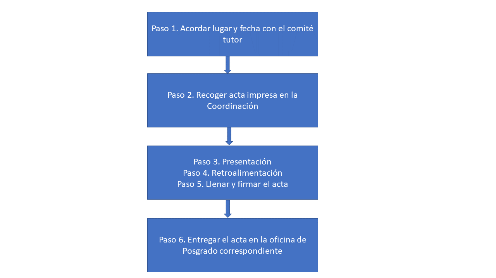

El tutoral cero es una evaluación extra-oficial (es decir, no cuenta para el promedio de la maestría) 
que tiene el objetivo de reunir por primera vez al comité tutor con la(el) estudiante al comienzo del 
segundo semestre y recibir retroalimentación en aspectos teóricos, metodológicos y logísticos; así como 
establecer un plan de trabajo semestral de la(el) estudiante. 

Los pasos son los siguientes:

**Paso 1.** Cada estudiante acordará con su comité tutor la fecha de cuando se llevará a cabo la reunión que, 
debido a las actuales condiciones sanitarias, deberá ser totalmente a distancia. 

**Paso 2.** Antes de la reunión, cada estudiante descargará el [formato de acta para evaluación](/assets/formatos/maestria/tutoral_0.pdf) y lo hará llegar a su comité tutor.

**Paso 3.** Para esta primera reunión, la(el) estudiante expone en un máximo de 30 minutos, los siguientes puntos:

 - Justificación del tema a estudiar: describir la problemática y la pertinencia para las Ciencias de la Sostenibilidad
 - Objetivos
 - Metodología propuesta: incluir área de estudio, tipo de datos, forma de obtención de los datos, forma de análisis de 
   los datos
 - Resultados esperados
 - Cronograma para los semestres II, III y IV: en forma de tabla o diagrama de flujo

**Paso 4.** Al término de la exposición, los miembros del comité tutor generan recomendaciones que comentan con la(el) 
estudiante. También definen, de manera conjunta, la modalidad de graduación preferida (tesis, reporte técnico, artículo 
o protocolo de investigación doctoral). 

Revisar [modalidades de graduación](/maestria/modalidades_graduacion/)

Si es el caso, la modalidad de graduación podrá ratificarse o modificarse en el primer tutoral oficial.

**Paso 5.** Después, el comité delibera, llena y firma el acta de evaluación para que la(el) estudiante la regrese a 
la coordinación. En el caso de tutor(a)s vía remota, la(el) estudiante le enviará el acta escaneada para que la firme y 
la regrese (también escaneada) a la Coordinación. 

Revisar el calendario de actividades para conocer la fecha límite para realizar el tutoral cero. La siguiente evaluación tutoral deberá ser realizada al final del segundo semestre. Ésta (y las siguientes dos) ya se calificarán en el sistema de SAEP. 

